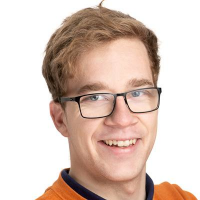

# Current PhD. students
 | Some text to what they worked on, and a [link](https://duckduckgo.com) to their work or thesis
--|-------------------

 | Some text to what they worked on, and a [link](https://duckduckgo.com) to their work or thesis
--|-------------------

 | Some text to what they worked on, and a [link](https://duckduckgo.com) to their work or thesis
--|-------------------

 | Some text to what they worked on, and a [link](https://duckduckgo.com) to their work or thesis
--|-------------------

# Current MSc. students

# Older Students

### 2020

 | Some text to what they worked on, and a [link](https://duckduckgo.com) to their work or thesis
--|-------------------

### 2019

### 2018
 | Some text to what they worked on, and a [link](https://duckduckgo.com) to their work or thesis
--|-------------------

### 2017

